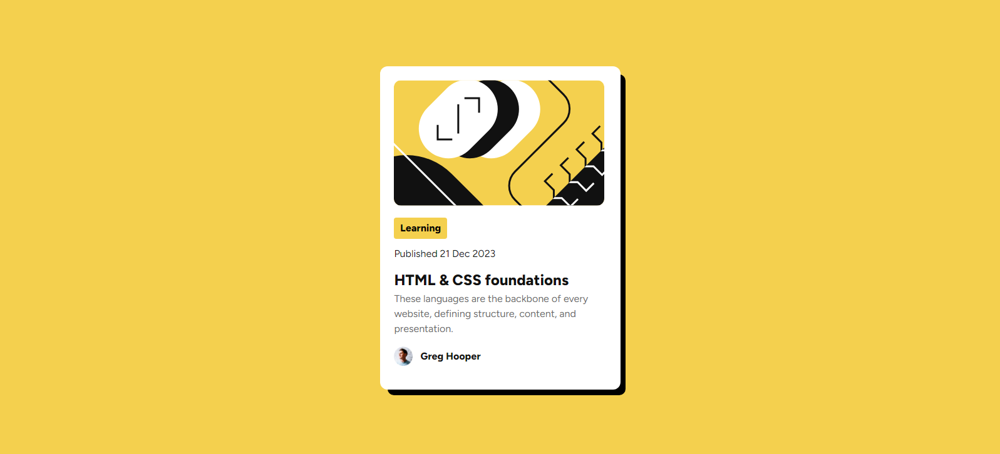

# Frontend Mentor - Blog preview card solution

This is a solution to the [Blog preview card challenge on Frontend Mentor](https://www.frontendmentor.io/challenges/blog-preview-card-ckPaj01IcS). Frontend Mentor challenges help you improve your coding skills by building realistic projects. 

## Table of contents

- [Overview](#overview)
  - [The challenge](#the-challenge)
  - [Screenshot](#screenshot)
  - [Links](#links)
  - [Built with](#built-with)
- [Author](#author)

## Overview

### The challenge

Users should be able to:

- See hover and focus states for all interactive elements on the page

### Screenshot

- normal state

- hover state

### Links

- Solution URL: [Add solution URL here](https://github.com/calixmnt/blog-preview-card--fem)
- Live Site URL: [Add live site URL here](https://calixmnt.github.io/blog-preview-card--fem/)

### Built with

- Semantic HTML5 markup
- CSS custom properties
- Flexbox
- Mobile-first workflow

## Author

- Website - [Calix Monnet](https://www.your-site.com)
- Frontend Mentor - [@calixmnt](https://www.frontendmentor.io/profile/calixmnt)
- Twitter - [@calixx23](https://www.twitter.com/calixx23)